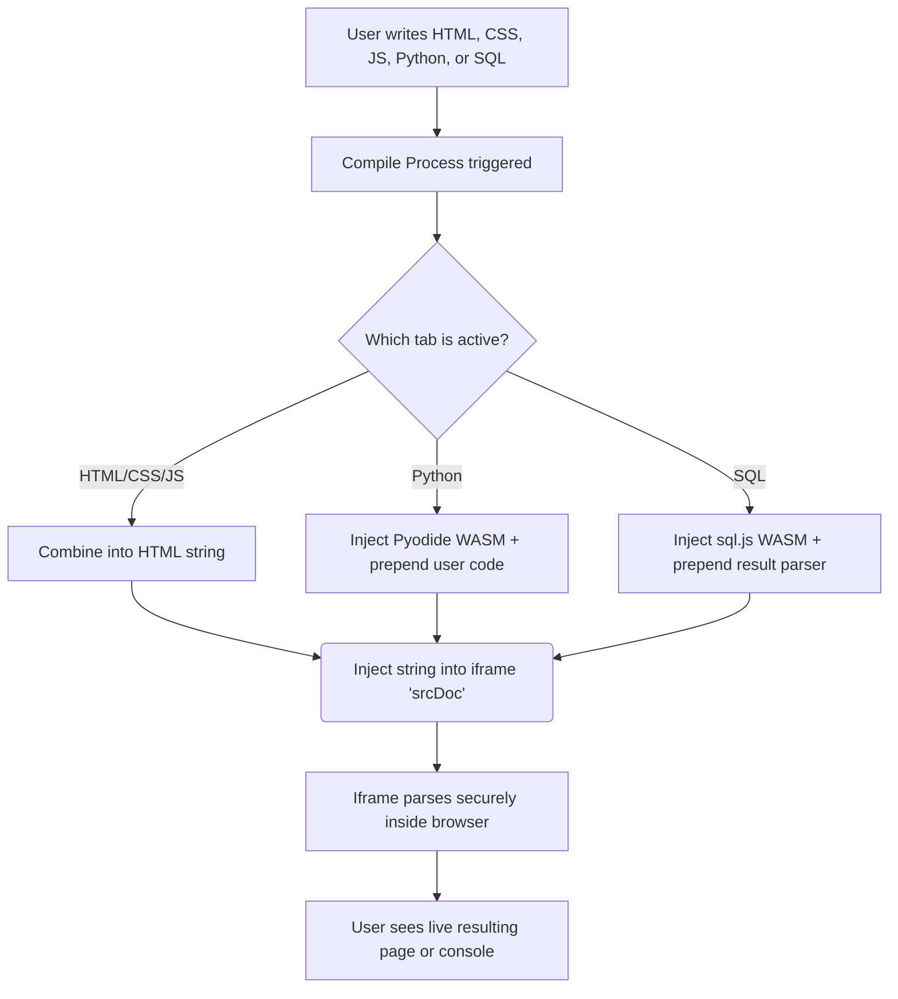

# ASTROCODE ARCHITECTURE & OVERVIEW

AstroCode is an interactive learning platform designed to teach programming through an engaging space-themed game, as well as providing an open-ended "Sandbox" IDE for freeform creation.

---

## 🏗️ 1. TECH STACK

- **Frontend Framework**: React 18+ (using Vite build tool)
- **Routing**: react-router-dom
- **Styling**: Context API for Theme switching + Pure CSS (`.css` files)
- **Code Editor**: `@monaco-editor/react` (a React wrapper for Microsoft's Monaco Editor, the engine behind VS Code)
- **Animations & Transitions**: `framer-motion`
- **Icons**: `lucide-react`
- **In-Browser Execution Environments**:
  - `CodeSandbox.jsx` + `new Function()` API for custom JavaScript runner.
  - `iframe` with `srcDoc` for HTML/CSS/JS Sandbox Mode.
  - `Pyodide` (WebAssembly Python) via CDN for Python execution.
  - `sql.js` (WebAssembly SQLite) via CDN for SQL execution.

---

## ⚙️ 2. HOW IT WORKS (ARCHITECTURE)

AstroCode is divided into two primary modes: **The Game Demo** and **The Creator Sandbox**.

### 🎮 A. The Game Engine (Space Missions)
The game engine guides the user through coding missions (moving a rover, collecting scrap, destroying asteroids).

```mermaid
graph TD
    A[User writes Code in Monaco Editor] --> B{Language Selection}
    B -->|JavaScript| C[Directly Executed]
    B -->|Python/Java/C++| D[engine/transpiler.js]
    D --> E[Regex-based Transpiler simplifies into JS logic]
    E --> C
    C --> F[engine/CodeSandbox.jsx]
    F --> G[new Function() executes JS]
    G --> H[Captures Game API Commands e.g., moveForward, thrust]
    H --> I[engine/GameRenderer.jsx]
    I --> J[React visually animates the commands over HTML Divs]
    J --> K[Code matches mission Goal > Mission Success!]
```

- **Transpiler**: `transpiler.js` acts as an MVP syntax converter. If a user selects Python, Java, or C++, the transpiler strips out boilerplate, converts syntax like `System.out.println` or `print()` to `console.log`, and converts `def main():` to generic JS functions so the browser can execute the logic natively without a heavy compiler.
- **Game API (`gameApi.js`)**: Exposes simulated functions like `rover.moveForward()`. When executed, it logs a "command object" rather than moving immediately. The UI then iterates over these commands sequentially to trigger animations.

### 💻 B. The Sandbox IDE (Creative Mode)
The Sandbox is a fully independent, open-ended development environment running entirely in the browser.



- **HTML/CSS/JS**: It merges the tab texts into one big HTML template string and injects it into an invisible `iframe` (the `srcDoc` property).
- **Python**: It uses **Pyodide** (a full CPython port to WebAssembly). We fetch the script via CDN, parse the `stdout` to print the strings directly to our virtual DOM, allowing complex python algorithms up to the browser memory limit.
- **SQL**: It uses **sql.js** (SQLite compiled to WebAssembly). The JavaScript intercepts the database queries, compiles them against an in-memory db, loops over the returns, and outputs HTML `<table>` tags directly.

---

## 🔮 3. FUTURE ROADMAP (WHAT WE CAN ADD)

1. **User Authentication & Database Integration**
   - **Need**: Firebase or Supabase backend.
   - **Why**: Allow users to create accounts, save their mission progress, and store their sandbox games persistently in the cloud.

2. **Social "Share" Links**
   - **Need**: A database to store encrypted code snippets.
   - **Why**: Users in Sandbox mode can click a "Share" button, which generates a unique URL (e.g., `astrocode.com/p/xj89fA`) to send to friends to play their creation.

3. **Backend Execution Environment (Docker & Node)**
   - **Need**: A microservice that accepts code and returns an output.
   - **Why**: Currently, the Game Demo uses a regex `transpiler.js` which is great for an MVP, but won't compile complex C++ pointers or Java abstractions. A server-side runner (like Piston) or a true WASM compiler could handle real multi-file execution.

4. **Multiplayer or Co-op Mode**
   - **Need**: WebSockets (Socket.io) or WebRTC.
   - **Why**: Two users could tackle a single mission together, with live cursor tracking in the Monaco Editor, similar to Google Docs or VS Code Live Share.

5. **Advanced Engine Updates**
   - Migrating the `GameRenderer.jsx` blocky HTML layout to a full `HTML5 Canvas API` or `PixiJS` engine for smooth 60fps animations, sprite sheets, particle effects, and collisions.

6. **More Factions and Custom Assets**
   - Let users spend "Scrap & Cores" to buy ship cosmetics and custom themes for their IDE interface.
